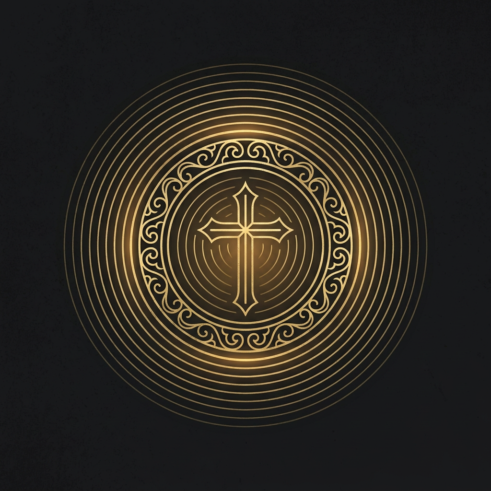

<p align="center"></p>

# Requiem

*A cathedral in a box — cinematic convolution reverb for orchestral and choral space.*

[](https://github.com/basilica-audio/requiem/actions/workflows/ci.yml)
[](https://www.gnu.org/licenses/agpl-3.0)

> **Work in progress.** Requiem is pre-1.0 and under active development. There are no built binaries or releases yet — building from source is currently the only way to run it. Expect breaking changes until v1.0.0 ships (see [Roadmap](#roadmap)).

<!-- ==BEGIN BODY== (plugin engineer: replace this block with What it is / Features / Signal flow / Roadmap) -->
## What it is

Requiem is a cinematic **convolution reverb** built for orchestral and choral space in symphonic metal productions - cathedral, hall, and chamber-style tails for strings, choir, and everything that needs to bloom into a wide, dark stereo image behind the wall of guitars. Rather than shipping (and licensing) an IR sample library, its impulse response is generated **procedurally**, off the audio thread, from Decay, Damping, Space, and Early/Late Balance - or you can load your own WAV/AIFF impulse response to override it entirely.

## Features

- `juce::dsp::Convolution`-based stereo reverb engine, IR generated from **Decay** (reverb time) and **Damping** (HF cutoff of the tail) - no bundled sample library, no licensing to manage.
- **Space** (Cathedral/Hall/Chamber) shapes the density/spread of a discrete early-reflection layer ahead of the diffuse tail; **Early/Late Balance** crossfades between that early layer and the diffuse late tail.
- **Freeze** sustains the tail's current spectral content instead of letting it decay - a bounded, convolution-based "hold the pad" mode.
- **Modulation** applies a subtle post-convolution chorus-style movement to the wet tail only, to soften metallic ringing and add richness (0% is a bit-identical passthrough).
- **Pre-Delay** (0-250 ms) separates the direct sound from the tail's onset - useful for keeping palm-muted rhythm parts tight while strings/choir bloom behind them.
- **Width** control (0-200%) reshapes the wet signal's stereo image via mid/side scaling, independent of the dry signal.
- Optional **user impulse response** override (Load IR.../Clear IR in the editor) - drop in your own captured space, persisted in the plugin's saved state. Rejects unreadable/non-audio files and pathologically long ones rather than loading them blindly.
- Latency-compensated Dry/Wet **Mix** and post-mix **Output** trim.
- AU / VST3 / Standalone, built on JUCE 8.

## Signal flow

```
input -> Pre-Delay -> Convolution (procedural or user IR) -> Modulation (chorus, wet only) -> Width (M/S, wet only) -> Dry/Wet Mix (latency-compensated) -> Output -> output
```

Decay, Damping, Space, Early/Late Balance, and Freeze don't touch the audio-thread signal path directly - they drive a background, message-thread-only impulse-response regeneration step (see [`docs/architecture.md`](docs/architecture.md) for the full explanation of why, and how it stays real-time safe).

## Parameters

| Parameter | Range | Default | Unit |
|---|---|---|---|
| Decay | 0.1 – 10.0 | 2.5 | s |
| Pre-Delay | 0 – 250 | 20 | ms |
| Damping | 500 – 20000 | 8000 | Hz |
| Space | Cathedral / Hall / Chamber | Hall | — |
| Early/Late Balance | 0 – 100 | 80 | % |
| Modulation | 0 – 100 | 0 | % |
| Freeze | off / on | off | — |
| Width | 0 – 200 | 100 | % |
| Mix | 0 – 100 | 35 | % |
| Output | -24 – 24 | 0 | dB |

Full musical descriptions and usage tips: [`docs/manual.md`](docs/manual.md).

## Roadmap

Tracked as GitHub milestones and issues (`gh issue list`, `gh api repos/basilica-audio/requiem/milestones`). Planned beyond v0.1.0: a preset system with factory cathedral/hall/chamber starting points and full state recall (M2), a custom vector-drawn GUI plus an accessibility pass (current editor is a functional slider/combo/toggle layout - M3), and signed/notarized release builds (M4).
<!-- ==END BODY== -->

## Installation

No pre-built binaries are published yet (see the work-in-progress notice above). Once releases begin, installation will follow the standard plugin locations:

**macOS**

| Format | Path |
|---|---|
| AU (Component) | `~/Library/Audio/Plug-Ins/Components/` |
| VST3 | `~/Library/Audio/Plug-Ins/VST3/` |

If Logic Pro doesn't pick up the plugin after installing, force a rescan by resetting the AU cache:

```sh
killall -9 AudioComponentRegistrar
auval -a
```

**Windows**

| Format | Path |
|---|---|
| VST3 | `C:\Program Files\Common Files\VST3\` |

## Building from source

Requires JUCE 8.0.14, C++20, and CMake ≥ 3.24. See [`docs/building.md`](docs/building.md) for full prerequisites and step-by-step build/test commands for macOS and Windows.

```sh
cmake -B build -G Ninja -DCMAKE_BUILD_TYPE=Release
cmake --build build
ctest --test-dir build --output-on-failure
```

## License

Requiem is licensed under the [GNU Affero General Public License v3.0](LICENSE) (AGPLv3).

This project uses [JUCE](https://juce.com) 8, whose open-source tier is licensed under AGPLv3 (as of JUCE 8; JUCE 7 and earlier used GPLv3), which is why this project is AGPLv3 rather than GPLv3. See [`docs/adr/0002-agplv3-licensing.md`](docs/adr/0002-agplv3-licensing.md) for the full reasoning.

VST is a registered trademark of Steinberg Media Technologies GmbH.

Requiem is an independent open-source project and is not affiliated with, endorsed by, or sponsored by any plugin manufacturer.
