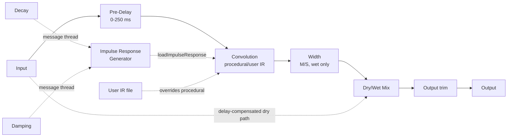

# Architecture

## Signal flow

Everything from Pre-Delay through Width is the "wet" path, owned by `ReverbEngine` (`src/dsp/ReverbEngine.{h,cpp}`). The dry path is the untouched input signal, delayed to stay time-aligned with the wet path's reported latency (see [Latency](#latency) below), then blended in at the Mix stage via `juce::dsp::DryWetMixer`. Output trim is applied after the mix.

## Module map

| Directory | Responsibility |
|---|---|
| `src/dsp/ImpulseResponseGenerator.{h,cpp}` | Pure, stateless procedural IR generation: decorrelated filtered-noise stereo tails with an RT60-style exponential envelope. No `juce::AudioProcessor`/`juce::dsp::Convolution` dependency, so it is directly unit-testable (see `tests/ImpulseResponseGeneratorTests.cpp`). Not real-time safe (allocates, does per-sample `exp()`/random calls) - called only from `ReverbEngine::prepare()` or its message-thread-only regeneration path. |
| `src/dsp/ReverbEngine.{h,cpp}` | The full signal chain: Pre-Delay, `juce::dsp::Convolution`, Width (M/S), `juce::dsp::DryWetMixer`, output `juce::dsp::Gain`. Owns the split between real-time-safe parameter setters (Pre-Delay, Width, Mix, Output - smoothed, callable every block from the audio thread) and message-thread-only operations (impulse-response (re)generation/loading, user-IR load/clear). Independent of `juce::AudioProcessor` so it is directly unit-testable (see `tests/EngineTests.cpp`). |
| `src/params` | Parameter layout and `AudioProcessorValueTreeState` definitions - parameter IDs, ranges, defaults. Single source of truth for what a preset captures (plus the non-parameter user-IR-path state key in `ParameterIds.h`'s `StateKeys` namespace). |
| `src/PluginProcessor.*` | Host plumbing: APVTS construction, `prepareToPlay`/`processBlock`/`reset`, latency reporting, state save/load (including the user-IR file path), and a `juce::Timer` that drives message-thread impulse-response regeneration. Reads APVTS values and pushes them into `ReverbEngine` every block; does not implement any DSP itself. |
| `src/PluginEditor.*` | A simple, functional v0.1 GUI: one rotary slider per parameter bound via `SliderAttachment`, plus "Load IR.../Clear IR" buttons for the user impulse-response override. A custom vector-drawn GUI is a later milestone. |

Dependency direction is one-way: `PluginEditor` -> `params` (via attachments) + `PluginProcessor` (via the IR load/clear methods), and `PluginProcessor` -> `params` + `dsp`. `src/dsp` has no upward dependency on the processor or UI, which is what keeps `ReverbEngine`/`ImpulseResponseGenerator` testable in isolation.

## Procedural impulse-response generation

Requiem's reverb tail is not a physically modelled room or a captured IR library - it is generated procedurally, off the audio thread, from just two parameters: Decay and Damping. Per channel (mono or stereo), `ReverbIR::generateProceduralImpulseResponse()`:

1. Sizes the buffer to `decaySeconds * sampleRate` samples (clamped to `[0.1, 10]` s to bound memory/CPU).
2. Generates white noise from a distinct, deterministic `juce::Random` stream per channel (so stereo output is decorrelated - the source of the tail's stereo width).
3. Runs that noise through a one-pole low-pass filter whose cutoff is the Damping parameter (higher Damping Hz = brighter/less-damped tail; lower = darker).
4. Multiplies by an RT60-style exponential envelope sized so the envelope reaches -60 dBFS at `t = decaySeconds`.

This is a standard "filtered noise burst" algorithmic-reverb IR model - simple, cheap to generate, and good enough for a cinematic wash, at the cost of not modelling any real room's early reflections or modal behaviour. A future milestone could layer in an early-reflection impulse burst ahead of the diffuse tail.

### Regeneration is message-thread only

Generating an IR (heap allocation, per-sample `exp()`/random calls) and loading it into `juce::dsp::Convolution` are both explicitly **not** real-time safe operations, so `ReverbEngine` splits Decay/Damping into two paths:

- `setDecaySeconds()`/`setDampingHz()` - real-time safe, callable every block from the audio thread. These only store the requested value in a `std::atomic<float>`; no allocation, no regeneration.
- `regenerateImpulseResponseIfNeeded()` - **message-thread only**. Compares the requested values against the last-generated ones and, only if they actually changed (beyond a small epsilon, to ignore floating-point noise from repeated identical automation pushes), regenerates the IR and calls `juce::dsp::Convolution::loadImpulseResponse()`.

`RequiemAudioProcessor` drives this via a `juce::Timer` started in `prepareToPlay()` (20 Hz - see `impulseResponseTimerHz` in `PluginProcessor.cpp`) and stopped in `releaseResources()`/the destructor. `juce::Timer` callbacks always run on the message thread, which is what makes this safe. This is the ROBUSTNESS-first v0.1 approach: no attempt is made to crossfade/interpolate between old and new IRs beyond whatever `juce::dsp::Convolution` itself does internally (per its documentation, `loadImpulseResponse()` is itself wait-free and loads the new IR on a background thread, becoming active once fully processed - so in practice a parameter change produces a clean, click-free swap once the ~20 Hz timer notices it, not a hard glitch).

### User impulse-response override

`ReverbEngine::loadUserImpulseResponse(File)` (message-thread only, e.g. from a GUI `FileChooser` callback) loads a user-supplied audio file via `juce::dsp::Convolution::loadImpulseResponse(File, ...)`, which handles format decoding/resampling internally (any format `juce::AudioFormatManager`'s basic formats support - WAV/AIFF/FLAC/etc). While active, `regenerateImpulseResponseIfNeeded()` is a no-op (Decay/Damping stop driving the convolution engine); `clearUserImpulseResponse()` reverts to the procedural generator immediately. The active file's path is persisted as a plain XML attribute alongside the APVTS state (see `ParameterIds.h`'s `StateKeys::userIrPath`) since it is a string, not an automatable parameter. Restoring a state whose file has moved/been deleted falls back to the procedural generator rather than failing the whole state load (see `RequiemAudioProcessor::setStateInformation` and `tests/StateTests.cpp`).

## Latency

`juce::dsp::Convolution`'s default configuration (used here - no `Latency`/`NonUniform` constructor argument) is documented as zero-latency, using a uniformly partitioned algorithm. `ReverbEngine::getLatencySamples()` queries `convolution.getLatency()` rather than assuming 0, so the plugin stays correct if a fixed-latency configuration is ever adopted instead; `RequiemAudioProcessor::prepareToPlay()` reports it via `setLatencySamples()`.

The dry path used by the Mix control is time-aligned against this (normally zero) latency the same way as the rest of the suite: `dryWetMixer.pushDrySamples()` captures the pre-processing signal before Pre-Delay/convolution/Width touch the buffer, `setWetLatency(getLatencySamples())` configures the mixer's internal delay line to match, and `mixWetSamples()` blends the two back together - so at Mix = 0% the output is a sample-accurate passthrough of the input, once shifted by `getLatencySamples()` (verified by `tests/EngineTests.cpp`'s null test, to < -90 dBFS residual).

**Pre-Delay is deliberately not part of this latency compensation.** It is an audible effect parameter - the gap between the direct sound and the reverb tail's onset - not something to hide from the listener, so it is applied only to the wet path after the dry signal has already been captured by `pushDrySamples()`. `tests/EngineTests.cpp`'s Pre-Delay tests verify this directly: feeding a unit impulse through the fully-wet engine and measuring the first non-negligible output sample shows the wet tail's onset tracks the Pre-Delay parameter (within a small tolerance for the convolution engine's own internal block/partition alignment), while Mix = 0% still nulls immediately regardless of the Pre-Delay setting.

One JUCE 8.0.14 behaviour worth calling out (shared with the rest of the suite - see e.g. Overture's `tests/DryWetMixerContractTests.cpp`): `DryWetMixer`'s internal dry/wet gain smoothers default their *target* to fully wet (`mix == 1.0`) until `setWetMixProportion()` is called, and the mixer's own `reset()` (invoked from its `prepare()`) only snaps the smoothers' *current* value to whatever *target* is set at that moment. `ReverbEngine::prepare()` works around this by calling `dryWetMixer.setWetMixProportion(lastMixProportion)` *before* its own `reset()` runs, so the mixer is already sitting at the correct dry/wet balance from the very first `process()` call.

## Parameter smoothing

- **Pre-Delay** recomputes the delay line's sample count once per block from a `juce::SmoothedValue<float, ValueSmoothingTypes::Linear>` - cheap enough to do per-sample, but block-rate smoothing keeps the implementation simple and is consistent with how the rest of the suite treats coefficient-style parameters (e.g. Overture's Tight/Tone filter cutoffs).
- **Width** is likewise smoothed and resolved to a scalar once per block, then applied as a plain per-sample mid/side multiply.
- **Mix** is smoothed entirely by `juce::dsp::DryWetMixer`'s own internal ~50 ms ramp; `ReverbEngine::setMixProportion()` just forwards the target value to it every block.
- **Output** is a plain `juce::dsp::Gain<float>` stage, which ramps sample-accurately via its own internal `SmoothedValue` (`setRampDurationSeconds`).
- **Decay** and **Damping** are not smoothed in the traditional sense at all - they only ever affect which impulse response is *generated*, on the message thread, at a bounded ~20 Hz rate (see [Regeneration is message-thread only](#regeneration-is-message-thread-only) above). There is no attempt to interpolate between the old and new IR's audio-thread `process()` behaviour beyond whatever `juce::dsp::Convolution::loadImpulseResponse()` does internally when swapping IRs mid-stream.
- All smoothers are seeded to their real starting value in `ReverbEngine::prepare()` (`lastPreDelayMs`/`lastWidthPercent`/`lastMixProportion`), so re-preparing (sample-rate change, etc.) never resets a live parameter back to a built-in default.

## Real-time safety

- `RequiemAudioProcessor::processBlock()` starts with `juce::ScopedNoDenormals`.
- All DSP state (the convolution engine, Pre-Delay delay line, dry/wet mixer, output gain) is allocated in `prepare()`/`prepareToPlay()` and never reallocated on the audio thread.
- `reset()` clears all delay-line/convolution/gain state without deallocating (`ReverbEngine::reset()`, called from both `AudioProcessor::reset()` and internally from `prepare()`).
- Parameter values are read via `apvts.getRawParameterValue()` atomics in `processBlock()`, never via `apvts.getParameter()->getValue()` (not guaranteed lock/allocation-free) and never via `String`-keyed lookups on the audio thread.
- Decay/Damping changes only ever write to a `std::atomic<float>` from `processBlock()`; the actual impulse-response (re)generation and `loadImpulseResponse()` call happen exclusively on the message thread via `RequiemAudioProcessor`'s `juce::Timer` (`timerCallback()` -> `ReverbEngine::regenerateImpulseResponseIfNeeded()`), never inside `process()`.
- `ReverbEngine::process()` treats a zero-sample block as a safe no-op before touching any filter/delay-line/convolution state.
- The Pre-Delay line's sample count is clamped to `[0, preDelayLine.getMaximumDelayInSamples()]` every block (`ReverbEngine.cpp`), which is itself sized once (250 ms at up to 192 kHz, plus margin) so `setMaximumDelayInSamples()` - which is documented as *not* real-time safe - is never called again after construction.
- The procedural IR generator's Damping cutoff is clamped below Nyquist for whatever sample rate is passed in (`ImpulseResponseGenerator.cpp`), mirroring the defensive clamping pattern used for filter cutoffs elsewhere in the suite.
