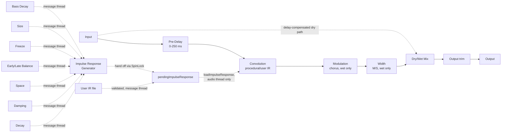

# Architecture

## Signal flow

Everything from Pre-Delay through Width is the "wet" path, owned by `ReverbEngine` (`src/dsp/ReverbEngine.{h,cpp}`). The dry path is the untouched input signal, delayed to stay time-aligned with the wet path's reported latency (see [Latency](#latency) below), then blended in at the Mix stage via `juce::dsp::DryWetMixer`. Output trim is applied after the mix.

## Module map

| Directory | Responsibility |
|---|---|
| `src/dsp/ImpulseResponseGenerator.{h,cpp}` | Pure, stateless procedural IR generation: decorrelated multiband (low/mid/high) filtered-noise stereo tails with independent per-band RT60-style exponential envelopes and a progressively descending high-band cutoff, plus a density-buildup discrete early-reflection layer shaped by Space/Size and blended in via Early/Late Balance, and a Freeze mode that flattens every band's envelope. No `juce::AudioProcessor`/`juce::dsp::Convolution` dependency, so it is directly unit-testable (see `tests/ImpulseResponseGeneratorTests.cpp`). Not real-time safe (allocates, does per-sample `exp()`/random calls) - called only from `ReverbEngine::prepare()` or its message-thread-only regeneration path. |
| `src/dsp/ReverbEngine.{h,cpp}` | The full signal chain: Pre-Delay, `juce::dsp::Convolution`, Modulation (`juce::dsp::Chorus`, wet only), Width (M/S), `juce::dsp::DryWetMixer`, output `juce::dsp::Gain`. Owns the split between real-time-safe parameter setters (Pre-Delay, Width, Mix, Output, Modulation - smoothed/internally-ramped, callable every block from the audio thread) and message-thread-only operations (impulse-response (re)generation/loading - now driven by Decay, Damping, Space, Early/Late Balance, Freeze, Size, and Bass Decay together - and user-IR load/clear, with format-reader validation and a length cap for robustness). Independent of `juce::AudioProcessor` so it is directly unit-testable (see `tests/EngineTests.cpp`). |
| `src/params` | Parameter layout and `AudioProcessorValueTreeState` definitions - parameter IDs, ranges, defaults. Single source of truth for what a preset captures (plus the non-parameter user-IR-path state key in `ParameterIds.h`'s `StateKeys` namespace). |
| `src/presets/{PresetManager,PresetBar,Localisation}.{h,cpp}` | The M2 preset system (`.scaffold/specs/preset-system-m2.md`), ported verbatim from `basilica-audio/nave`'s pilot implementation - see `docs/preset-system-notes.md` (nave) for the replication recipe. `PresetManager` owns factory (BinaryData-embedded `presets/factory/*.json`) and user (disk-scanned) preset discovery, load/save/rename/delete, default resolution, import/export (single files and zip banks), and a dirty-state flag, reading/writing APVTS exclusively through its public API. `PresetBar` is the horizontal-strip editor half. `Localisation` installs the German frame-string mapping (`resources/i18n/de.txt`) when the system language starts with "de", else falls through to English - selected once at editor construction, never touching core/DSP parameter names. |
| `src/PluginProcessor.*` | Host plumbing: APVTS + `PresetManager` construction, `prepareToPlay`/`processBlock`/`reset`, latency reporting, state save/load (including the user-IR file path), and a `juce::Timer` that drives message-thread impulse-response regeneration. Reads APVTS values and pushes them into `ReverbEngine` every block; does not implement any DSP itself. |
| `src/PluginEditor.*` | A simple, functional v0.1/v0.2 GUI: a `PresetBar` strip at the top, one rotary slider per float/choice parameter (Space uses a `ComboBox` via `ComboBoxAttachment`, populated directly from the parameter's own choice list; Freeze uses a `ToggleButton` via `ButtonAttachment`), plus "Load IR.../Clear IR" buttons for the user impulse-response override. A custom vector-drawn GUI is a later milestone (M3). |

Dependency direction is one-way: `PluginEditor` -> `params` (via attachments) + `presets` (via `PresetBar`) + `PluginProcessor` (via the IR load/clear methods), and `PluginProcessor` -> `params` + `presets` + `dsp`. `src/dsp` has no upward dependency on the processor, presets, or UI, which is what keeps `ReverbEngine`/`ImpulseResponseGenerator` testable in isolation.

## Procedural impulse-response generation (v0.2.0 research-derived rework)

Requiem's reverb tail is not a physically modelled room or a captured IR library - it is generated procedurally, off the audio thread, from seven parameters: Decay, Damping, Space, Early/Late Balance, Freeze, and the v0.2.0 additions Size and Bass Decay. Per channel (mono or stereo), `ReverbIR::generateProceduralImpulseResponse()` builds two layers and blends them. **v0.2.0 replaces both of v1's defects** (see `docs/design-brief.md`/`docs/research-notes.md` for the full sourcing): the early-reflection layer now builds *density* up over time instead of decaying geometrically from a loud tap 0, and the diffuse tail is now a **multiband** (low/mid/high) decay instead of one static global filter.

**The diffuse late-tail layer** (multiband as of v0.2.0):

1. Sizes the buffer to `decaySeconds * sampleRate` samples (clamped to `[0.1, 10]` s to bound memory/CPU).
2. Generates white noise from a distinct, deterministic `juce::Random` stream per channel (so stereo output is decorrelated - the source of the tail's stereo width).
3. Splits that noise into three bands via a perfect-reconstruction cascaded one-pole crossover at ~500 Hz/~5 kHz (`ReverbIR::lowMidCrossoverHz`/`midHighCrossoverHz`, research-derived from LiquidSonics Reverberate's documented ~600 Hz/~6 kHz precedent): low = LPF@500, mid = LPF@5000 - LPF@500, high = raw - LPF@5000.
4. Applies the high band's own additional one-pole filter with a **progressively descending cutoff** - starting brighter than Damping and settling at Damping (the terminal HF corner) by `t = decaySeconds` - so the tail measurably darkens as it decays rather than holding one static filter color throughout (`tests/ImpulseResponseGeneratorTests.cpp`'s "Progressive HF darkening" spectral-centroid test). Freeze uses a *static* terminal-Damping cutoff instead (no time-variance), so a sustained texture holds one consistent spectral color rather than continuing to darken while frozen.
5. Multiplies each band by its own RT60-style exponential envelope: the mid band uses Decay directly (the reference rate); the low band's rate is Decay divided by the Bass Decay multiplier (25-175%, default 130% - bass rings measurably longer, matching real-hall low-frequency-decay measurements); the high band's rate is Decay divided by an implicit, non-parameterized 80% multiplier (highs finish measurably before the mid band). All three envelopes reach -60 dBFS at `t = decaySeconds * <band's own multiplier>`. Freeze forces every band's envelope flat (1.0) instead (see [Freeze](#freeze) below).

**The early-reflection layer**, generated independently (its own deterministic `juce::Random` stream, so it never correlates with the diffuse noise above) and added on top:

1. Space (Cathedral/Hall/Chamber) selects a buildup-window/flat-window/tap-count envelope, continuously scaled within that envelope by the new Size parameter (0-100%, default 50%, decoupled from Decay/RT60): at Size 50%, Hall's buildup window is 35 ms and its flat-window end is 160 ms, matching Griesinger's documented defaults exactly (`docs/research-notes.md` section 1).
2. A tap budget (55% of Space's total tap count) is allocated across deterministic ~10 ms "density steps" with a strictly non-decreasing tap count per step (triangular weighting: later steps get more taps), so measured tap density in successive 10 ms sub-windows is *provably* non-decreasing across the buildup window by construction - the literal, testable form of "density builds up over time" replacing v1's uniformly-random placement and geometrically-decaying amplitude. The remaining tap budget is spent on an evenly-spaced, lower-amplitude "flat" handoff phase from the buildup window's end through the Space/Size-scaled flat-window end, before the diffuse tail takes over - matching Griesinger's "holds roughly flat energy through ~160 ms" finding.
3. Tap 0 is always forced to sample 0, at fixed positive amplitude - a proxy for the earliest/loudest boundary reflection - so the generated IR's onset never depends on Space/Size/Early-Late-Balance. This matters: Pre-Delay's timing tests measure that onset directly (see [Latency](#latency) below), and it must stay independent of these parameters.

**Early/Late Balance** then crossfades the two layers with an equal-power (`cos`/`sin`) curve: 0% is the early-reflection layer alone (a short, direct "slap"), 100% is the diffuse tail alone (a smooth wash), and the default (80%) keeps the tail diffuse-dominant while giving the early layer some presence.

This is a standard "filtered noise burst plus a discrete early-reflection train" algorithmic-reverb IR model - simple, cheap to generate, and good enough for a cinematic wash, at the cost of not modelling any real room's modal behaviour or a physically accurate early-reflection geometry. As `docs/design-brief.md`'s Honesty section states: the voicing is research-derived from public manuals/interviews/trade-press/DSP literature, not measured against any commercial hardware or software, and no third-party impulse response was sampled or approximated.

### Freeze

Freeze (a boolean parameter) sustains the tail's current spectral content instead of letting it decay: when on, every band's envelope is flat (1.0) across the whole buffer rather than RT60-decaying, and the high band's descending-cutoff filter is replaced with a static terminal-Damping cutoff, **and** the diffuse layer plays at full gain regardless of Early/Late Balance; the early-reflection layer is suppressed entirely. In other words, a frozen tail is always the full sustained diffuse wash, never a sustained early-reflection pattern - Early/Late Balance is ignored while frozen (see `tests/ImpulseResponseGeneratorTests.cpp`'s dedicated Freeze tests for the exact contract).

The buffer length is still bounded to `decaySeconds` worth of samples - `juce::dsp::Convolution` processes a finite kernel, so this is a **bounded sustain** (as long as the Decay knob allows, up to 10 s), not a literal infinite loop. This is a deliberate architectural choice, not a gap: research into feedback-loop-based "infinite reverb" designs (`docs/research-notes.md` section 4, citing Valhalla DSP's ValhallaShimmer design notes) documents that repeated filtering in a feedback path progressively dulls the sustained texture, and that feedback-delay/allpass-cascade freeze designs are prone to audible periodicity as diffusor order/feedback increases. Because Requiem's Freeze is a finite, statically-generated convolution kernel rather than a feedback loop, it structurally cannot develop either artifact - `tests/ImpulseResponseGeneratorTests.cpp`'s "Freeze non-periodicity" test is a regression guard proving Freeze was never reimplemented as a short looped buffer.

### Modulation

A subtle post-convolution `juce::dsp::Chorus<float>` stage (see `ReverbEngine::process()`) is applied to the wet tail only, controlled by the Modulation parameter (0-100%). It exists to soften the slightly metallic/comb-filtered ring a short procedurally generated IR can have, and to add a touch of movement/richness to a static tail. Rate (0.35 Hz) and centre delay (12 ms) are fixed, non-automatable constants tuned for a subtle effect rather than an obvious chorus/flanger; only depth (mapped to `[0.05, 0.35]`) and mix (mapped to `[0, 0.5]`) scale with the Modulation parameter, both 0 at Modulation = 0% - so 0% is *designed* to be a no-op passthrough of the unmodulated tail (`tests/EngineTests.cpp`'s Modulation test verifies both the "measurably different at full depth" and "no reported-latency change" halves of this contract; the "0% is bit-identical" half specifically is not currently covered by a dedicated bit-exact null test, unlike the outer Mix/DryWetMixer null test below - see issue #11).

`juce::dsp::Chorus` owns its own internal `juce::dsp::DryWetMixer`, but - unlike the outer `DryWetMixer` below - it does **not** need any external "prime the target before `reset()`" workaround: JUCE 8.0.14's `Chorus<SampleType>::prepare()` calls `update()` (which sets the internal mixer's *target* wet proportion from whatever `setMix()` last configured) *before* its own `reset()`, so it self-primes correctly regardless of call order. `ReverbEngine::prepare()` still configures the chorus's rate/depth/mix/feedback from `lastModulationAmount01` *before* calling `modulationChorus.prepare()` - not to work around a gotcha, but simply so `lastModulationAmount01` (rather than the class's built-in defaults of rate 1 Hz / depth 0.25 / mix 0.5) is what gets primed in the first place.

### Regeneration: generated off the audio thread, applied on it

Generating an IR (heap allocation, per-sample `exp()`/random calls) is explicitly **not** a real-time-safe operation, so `ReverbEngine` splits Decay/Damping/Space/Early-Late-Balance/Freeze/Size/Bass Decay into two paths:

- `setDecaySeconds()`/`setDampingHz()`/`setSpaceType()`/`setEarlyLateBalance()`/`setFreeze()` - real-time safe, callable every block from the audio thread. These only store the requested value in an atomic (`std::atomic<float>`, `std::atomic<int>` for the Space enum, or `std::atomic<bool>` for Freeze); no allocation, no regeneration.
- `regenerateImpulseResponseIfNeeded()` - **message-thread only**. Compares all five requested values against the last-generated ones and, only if any actually changed (a small epsilon on the float ones, to ignore floating-point noise from repeated identical automation pushes; exact comparison on Space/Freeze), regenerates the IR.

Unlike the pre-v0.1.1 design, `regenerateImpulseResponseIfNeeded()` does **not** call `juce::dsp::Convolution::loadImpulseResponse()` itself. JUCE 8.0.14's own threading contract for `juce::dsp::Convolution` (`juce_dsp/frequency/juce_Convolution.h`) states: "It is not safe to interleave calls to the methods of this class. If you need to load new impulse responses during processing the load() calls must be synchronised with process() calls, which in practice means making the load() call from the audio thread." Concretely, `loadImpulseResponse()` and `process()` both mutate the same internal (non-atomic) pending-command state without their own synchronisation, so calling `loadImpulseResponse()` from the message thread while `process()` runs concurrently on the audio thread is a genuine data race (see issue #13). Instead:

- The message thread only ever *generates* the buffer (or, for a user IR, validates the candidate file) and hands the request off through a `juce::SpinLock`-guarded slot (`ReverbEngine::pendingImpulseResponse`) - the pattern `juce::dsp::Convolution`'s own docs recommend for transferring an `AudioBuffer` to the audio thread without allocating there ("...use some wait-free construct (a lock-free queue or a SpinLock/GenericScopedTryLock combination)").
- `ReverbEngine::process()` (the audio thread) calls `applyPendingImpulseResponseIfAny()` at the top of every block, which *try*-locks that same slot and, if it succeeds and a request is pending, is the only place `convolution.loadImpulseResponse()` is ever called outside `prepare()`. The try-lock never blocks - if the message thread happens to be mid-update, `process()` simply retries on the next block.

`RequiemAudioProcessor` drives the message-thread half via a `juce::Timer` started in `prepareToPlay()` (20 Hz - see `impulseResponseTimerHz` in `PluginProcessor.cpp`) and stopped in `releaseResources()`/the destructor. This is still the ROBUSTNESS-first v0.1 approach: no attempt is made to crossfade/interpolate between old and new IRs beyond whatever `juce::dsp::Convolution` itself does internally (per its documentation, `loadImpulseResponse()` is itself wait-free and loads the new IR on a background thread, becoming active once fully processed - so in practice a parameter change produces a clean, click-free swap once the ~20 Hz timer notices it and the next audio block picks it up, not a hard glitch).

### User impulse-response override

`ReverbEngine::loadUserImpulseResponse(File)` (message-thread only, e.g. from a GUI `FileChooser` callback) validates the file before touching any engine state: it opens a `juce::AudioFormatReader` for it via a dedicated `juce::AudioFormatManager` (constructed once, basic formats registered) and rejects the file - returning `false`, leaving `usingUserImpulseResponse`/the active IR completely untouched - if it isn't readable as audio (0 channels, non-positive length, or the reader itself fails to open), or if it is longer than `ReverbEngine::maxUserImpulseResponseSeconds` (30 s, generous for any real captured space while bounding the convolution engine's worst-case CPU/memory against a mis-selected non-IR file). Only once that sanity check passes does it hand the file off the same way the procedural path does (see above) for `process()` to load via `juce::dsp::Convolution::loadImpulseResponse(File, ...)` on the audio thread, which handles format decoding/resampling internally (any format `juce::AudioFormatManager`'s basic formats support - WAV/AIFF/FLAC/etc). While active, `regenerateImpulseResponseIfNeeded()` is a no-op (Decay/Damping/Space/Early-Late-Balance/Freeze/Size/Bass Decay stop driving the convolution engine); `clearUserImpulseResponse()` reverts to the procedural generator immediately (queuing a fresh procedural buffer the same way). The active file's path is persisted as a plain XML attribute alongside the APVTS state (see `ParameterIds.h`'s `StateKeys::userIrPath`) since it is a string, not an automatable parameter. Restoring a state whose file has moved/been deleted falls back to the procedural generator rather than failing the whole state load (see `RequiemAudioProcessor::setStateInformation` and `tests/StateTests.cpp`).

## Latency

`juce::dsp::Convolution`'s default configuration (used here - no `Latency`/`NonUniform` constructor argument) is documented as zero-latency, using a uniformly partitioned algorithm. `ReverbEngine::getLatencySamples()` queries `convolution.getLatency()` rather than assuming 0, so the plugin stays correct if a fixed-latency configuration is ever adopted instead; `RequiemAudioProcessor::prepareToPlay()` reports it via `setLatencySamples()`.

The dry path used by the Mix control is time-aligned against this (normally zero) latency the same way as the rest of the suite: `dryWetMixer.pushDrySamples()` captures the pre-processing signal before Pre-Delay/convolution/Width touch the buffer, `setWetLatency(getLatencySamples())` configures the mixer's internal delay line to match, and `mixWetSamples()` blends the two back together - so at Mix = 0% the output is a sample-accurate passthrough of the input, once shifted by `getLatencySamples()` (verified by `tests/EngineTests.cpp`'s null test, to < -90 dBFS residual).

**Pre-Delay is deliberately not part of this latency compensation.** It is an audible effect parameter - the gap between the direct sound and the reverb tail's onset - not something to hide from the listener, so it is applied only to the wet path after the dry signal has already been captured by `pushDrySamples()`. `tests/EngineTests.cpp`'s Pre-Delay tests verify this directly: feeding a unit impulse through the fully-wet engine and measuring the first non-negligible output sample shows the wet tail's onset tracks the Pre-Delay parameter (within a small tolerance for the convolution engine's own internal block/partition alignment), while Mix = 0% still nulls immediately regardless of the Pre-Delay setting. This is exactly why the early-reflection layer's tap 0 is always forced to sample 0 (see [Procedural impulse-response generation](#procedural-impulse-response-generation) above) - Space/Early-Late-Balance must never perturb that onset measurement.

**Modulation adds no reported latency either.** It is a short, continuously modulated delay line (a chorus effect), not a bulk delay - treated the same way a hardware chorus/vibrato pedal would be, not as something requiring host-side compensation. `tests/EngineTests.cpp`'s Modulation test asserts `getLatencySamples()` is identical at 0% and 100% depth.

One JUCE 8.0.14 behaviour worth calling out (shared with the rest of the suite - see e.g. Overture's `tests/DryWetMixerContractTests.cpp`): `DryWetMixer`'s internal dry/wet gain smoothers default their *target* to fully wet (`mix == 1.0`) until `setWetMixProportion()` is called, and the mixer's own `reset()` (invoked from its `prepare()`) only snaps the smoothers' *current* value to whatever *target* is set at that moment. `ReverbEngine::prepare()` works around this by calling `dryWetMixer.setWetMixProportion(lastMixProportion)` *before* its own `reset()` runs, so the mixer is already sitting at the correct dry/wet balance from the very first `process()` call. `juce::dsp::Chorus`'s own internal `DryWetMixer` is subject to the identical gotcha - see [Modulation](#modulation) above for how `ReverbEngine::prepare()` handles it the same way.

## Parameter smoothing

- **Pre-Delay** recomputes the delay line's sample count once per block from a `juce::SmoothedValue<float, ValueSmoothingTypes::Linear>` - cheap enough to do per-sample, but block-rate smoothing keeps the implementation simple and is consistent with how the rest of the suite treats coefficient-style parameters (e.g. Overture's Tight/Tone filter cutoffs).
- **Width** is likewise smoothed and resolved to a scalar once per block, then applied as a plain per-sample mid/side multiply.
- **Mix** is smoothed entirely by `juce::dsp::DryWetMixer`'s own internal ~50 ms ramp; `ReverbEngine::setMixProportion()` just forwards the target value to it every block.
- **Modulation** is smoothed by `juce::dsp::Chorus`'s own internal smoothers (a `SmoothedValue` for depth, its own `DryWetMixer`'s ~50 ms ramp for mix); `ReverbEngine::setModulationAmount()` just forwards the mapped depth/mix targets to it every block, the same pattern as Mix.
- **Output** is a plain `juce::dsp::Gain<float>` stage, which ramps sample-accurately via its own internal `SmoothedValue` (`setRampDurationSeconds`).
- **Decay**, **Damping**, **Space**, **Early/Late Balance**, and **Freeze** are not smoothed in the traditional sense at all - they only ever affect which impulse response is *generated*, on the message thread, at a bounded ~20 Hz rate, and *applied* on the audio thread on the next `process()` call (see [Regeneration: generated off the audio thread, applied on it](#regeneration-generated-off-the-audio-thread-applied-on-it) above). There is no attempt to interpolate between the old and new IR's audio-thread `process()` behaviour beyond whatever `juce::dsp::Convolution::loadImpulseResponse()` does internally when swapping IRs mid-stream.
- All smoothers/DSP-object targets are seeded to their real starting value in `ReverbEngine::prepare()` (`lastPreDelayMs`/`lastWidthPercent`/`lastMixProportion`/`lastModulationAmount01`), so re-preparing (sample-rate change, etc.) never resets a live parameter back to a built-in default.

## Real-time safety

- `RequiemAudioProcessor::processBlock()` starts with `juce::ScopedNoDenormals`.
- All DSP state (the convolution engine, Pre-Delay delay line, Modulation chorus, dry/wet mixer, output gain) is allocated in `prepare()`/`prepareToPlay()` and never reallocated on the audio thread.
- `reset()` clears all delay-line/convolution/chorus/gain state without deallocating (`ReverbEngine::reset()`, called from both `AudioProcessor::reset()` and internally from `prepare()`).
- Parameter values are read via `apvts.getRawParameterValue()` atomics in `processBlock()`, never via `apvts.getParameter()->getValue()` (not guaranteed lock/allocation-free) and never via `String`-keyed lookups on the audio thread. This includes the `AudioParameterChoice` (Space) and `AudioParameterBool` (Freeze) parameters, both of which still expose their raw value as a plain `float` (choice index, or 0.0/1.0) via `getRawParameterValue()`.
- Decay/Damping/Space/Early-Late-Balance/Freeze/Size/Bass Decay changes only ever write to an atomic from `processBlock()`; the actual impulse-response *generation* happens on the message thread via `RequiemAudioProcessor`'s `juce::Timer` (`timerCallback()` -> `ReverbEngine::regenerateImpulseResponseIfNeeded()`), never inside `process()` - but the `juce::dsp::Convolution::loadImpulseResponse()` *call itself* happens only inside `process()`, on the audio thread, per `juce::dsp::Convolution`'s own threading contract (see [Regeneration: generated off the audio thread, applied on it](#regeneration-generated-off-the-audio-thread-applied-on-it) above).
- `ReverbEngine::process()` treats a zero-sample block as a safe no-op before touching any filter/delay-line/convolution/chorus state.
- The Pre-Delay line's sample count is clamped to `[0, preDelayLine.getMaximumDelayInSamples()]` every block (`ReverbEngine.cpp`), which is itself sized once (250 ms at up to 192 kHz, plus margin) so `setMaximumDelayInSamples()` - which is documented as *not* real-time safe - is never called again after construction.
- The procedural IR generator's Damping cutoff is clamped below Nyquist for whatever sample rate is passed in (`ImpulseResponseGenerator.cpp`), mirroring the defensive clamping pattern used for filter cutoffs elsewhere in the suite.
- `ReverbEngine::loadUserImpulseResponse()` validates the candidate file (a `juce::AudioFormatReader` open/sanity-check) on the message thread, exactly like the existing procedural-regeneration path; the actual `juce::dsp::Convolution::loadImpulseResponse(File, ...)` call, like the procedural path, happens only inside `process()`.

## M2 preset system and i18n frame

`src/presets/` (ported verbatim from `basilica-audio/nave`'s pilot - see that repo's `docs/preset-system-notes.md` for the exact replication recipe) adds:

- **`PresetManager`**: constructed in `RequiemAudioProcessor`'s initialiser list (right after `apvts`), wired to 11 factory presets embedded via `juce_add_binary_data` (`RequiemBinaryData`, `presets/factory/*.json` - see `docs/presets.md`) plus user presets scanned from `~/Library/Audio/Presets/Yves Vogl/Requiem/` (macOS) / `%APPDATA%/Yves Vogl/Requiem/Presets/` (Windows). `RequiemAudioProcessor`'s constructor calls `presetManager.applyStartupDefault()` once, after the parameter-pointer `jassert`s.
- **`PresetBar`**: a horizontal strip at the top of the editor (`[<] [PresetName*] [>] [Save] [Save As...] [Delete] [Import...] [Export...]`), bound to `presetManager`.
- **`Localisation`**: installs `resources/i18n/de.txt`'s German mapping when `juce::SystemStats::getUserLanguage()` starts with "de", via a `PluginEditor.cpp` helper (`initLocalisationThenGetPresetManager()`) called from `presetBar`'s own member-initialiser expression - the only way to guarantee `installLocalisation()` runs before `presetBar`'s constructor calls `TRANS()` on its own labels, given C++ initialises members in declaration order regardless of initialiser-list order.

Preset JSON files use the suite-wide `basilica-preset-1` format (`"plugin": "com.yvesvogl.requiem"`, plain unnormalised parameter values keyed by parameter ID); import is forward/backward-tolerant (unknown IDs ignored, missing IDs keep their `ParameterLayout` default) - see `tests/PresetManagerTests.cpp` and `tests/StateTests.cpp`'s dedicated v1->v2 tolerant-import test. Only user-facing **frame** strings (PresetBar labels/menus/dialogs) are wrapped in `TRANS()`; parameter names/units are never translated (`tests/LocalisationTests.cpp`).

## Test coverage

Beyond the DSP-feature-specific tests referenced throughout this document, `tests/` also covers:

- **Sample-rate sweeps** (`tests/SampleRateSweepTests.cpp`): the null test, general finite-output/latency checks, and repeated up/down sample-rate changes, all run across 44.1/48/88.2/96/176.4/192 kHz.
- **Bus-layout configurations** (`tests/BusLayoutTests.cpp`): `isBusesLayoutSupported()` accept/reject behaviour, and actual mono/stereo processing (including switching between them across `prepareToPlay()` calls). Requiem has a single main I/O bus and no sidechain, so there is no sidechain-specific coverage to add.
- **Long-run NaN/Inf stability** (`tests/LongRunStabilityTests.cpp`): several seconds of audio across thousands of small blocks under continuous randomised automation of every parameter (including Space/Early-Late-Balance/Modulation/Freeze), plus a dedicated long-run Freeze scenario (a frozen tail processed continuously for several seconds must stay finite and sanely bounded, not just "not NaN").
- **Extreme parameter automation**: `tests/RobustnessTests.cpp`'s range-edge and rapid-automation tests, extended to cover Space/Early-Late-Balance/Modulation/Freeze at their extremes alongside the v0.1 parameters.
- **v0.2.0 research-derived guarantees** (`tests/ImpulseResponseGeneratorTests.cpp`, tagged `[v2]`): early-reflection energy ratio (0-50ms carries 2-3x the energy of the following 50-150ms window), density-buildup monotonicity, onset invariance, Size/Decay decoupling, multiband decay ordering (low > mid > high RT60) and Bass Decay's monotonic effect on the low band only, progressive HF-darkening spectral-centroid monotonicity, and Freeze non-periodicity - plus `tests/EngineTests.cpp`/`tests/StateTests.cpp`'s Size/Bass-Decay regeneration-reaction and user-IR-override-unaffected tests.
- **M2 preset system** (`tests/PresetManagerTests.cpp`) and **i18n frame** (`tests/LocalisationTests.cpp`).
